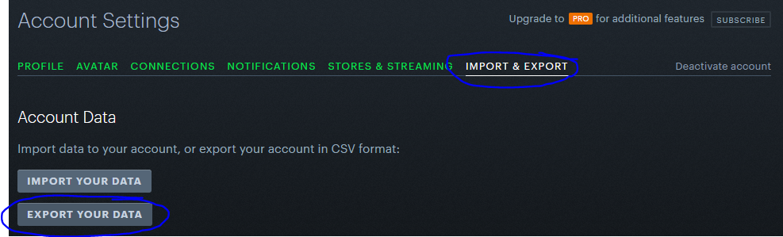
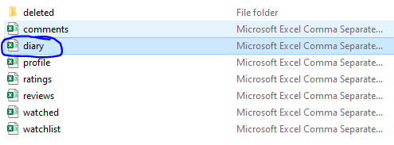

# Letterboxd Diary Parser

Reads the `diary.csv` file exported from your Letterboxd collection of exported files and generates an HTML report with some graphics.

## Dependencies

Just run the command:

```shell
pip install -r requirements.txt
```

## Running

Place the `diary.csv` file on the root project directory and run the following command:

```shell
python main.py diary.csv <year>
```

Where:
 * `year` is the year that contains on your diary

## How to export data

Follow these steps in order to export your data:

 * On your Letterboxd account, login 
 * Go to on you user dropdown, and press Settings
 * On settings, press IMPORT & EXPORT
 * Press EXPORT YOUR DATA button



 * After download it choose the `diary.csv` file



**HAVE FUN**